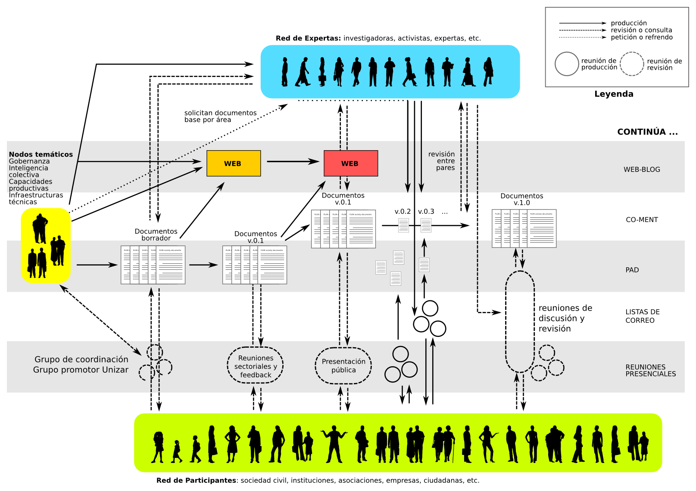
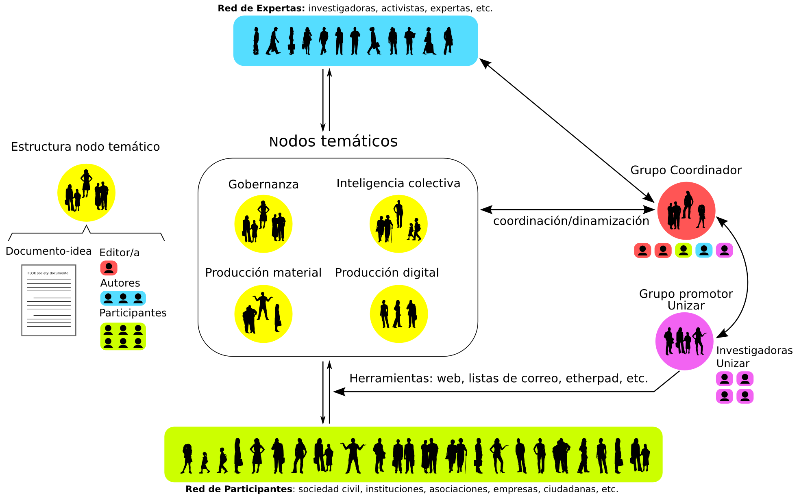

# Etopia ciudadana 

### Proceso de investigación participativa para la transición hacia una economía social del conocimiento desde Etopia: Centro de Arte y Tecnología

## 1. Definición y objetivos del proyecto

Etopia Ciudadana es un proyecto impulsado desde la Universidad de Zaragoza y en colaboración con el Ayuntamiento de Zaragoza, con el objetivo de desarrollar nuevas líneas de participación ciudadana e innovación social en Etopia: Centro de Arte y Tecnología. El proyecto pretende elaborar de forma colaborativa una serie de documentos-idea para plantear nuevas líneas de desarrollo del proyecto de Etopia.

El proyecto inicial de Etopia pretendía promover un ecosistema de innovación para impulsar, la creatividad de base tecnológica, las comunidades de talento e innovación social y el cambio de modelo productivo hacia una economía basada en el factor conocimiento. Sin embargo, el proyecto, diseñado en el boom de la burbuja inmobiliaria, se enfrenta a un contexto social muy diferente que dificulta el desarrollo de las líneas originales tal y como fueron concebidas. Ello provoca una desconexión parcial respecto a los procesos de organización ciudadana y necesidades sociales de la ciudad, que han tomado, por la vía de los hechos y al margen de la institución, la delantera en los procesos de innovación social en sentido amplio. Ante esta situación, el citado proyecto plantea la necesidad de renovar la formulación del proyecto de Etopia y repensarlo como una institución al servicio de las necesidades y bienes comunes de la ciudad, apostando por la participación ciudadana directa y una economía social basada en el conocimiento común y abierto.

### 1.1. Objetivo principal

Desarrollar un proyecto de investigación y participación ciudadana desde el espacio institucional de Etopia: Centro de Arte y Tecnología destinado a mejorar sus aportes a una economía social basada en el conocimiento y su integración en el ecosistema de instituciones de participación e innovación de la ciudad. El proyecto se llevará a cabo entre octubre y diciembre de 2015, desarrollando un proceso de investigación colaborativa y abierta con dos objetivos principales:
* Desarrollar líneas de desarrollo e innovación vertebrales que definan el proyecto de Etopia y su contenido a medio-largo plazo. La programación formativa, investigadora y divulgativa de la institución se organizará en torno a esas líneas, cuya formulación se mantendrá abierta y coherente con el funcionamiento de un espacio abierto a la participación e innovación de la ciudad y a una economía basada en el conocimiento libre.
* Desarrollar un modelo de gobernanza participativa que permita una gestión colaborativa de las líneas de desarrollo e innovación definidas en el modelo anterior, con el objetivo de una gestión democrática, abierta y transparente del centro y sus actividades.

###1.2. Líneas de investigación

El proyecto consistirá en la dinamización de un proceso de participación e investigación colaborativa para definir conjuntamente las líneas especificadas arriba. Como uno de los resultados del proceso se elaborarán una serie de documentos de referencia (documentos-idea). La propia delimitación de las áreas que los documentos-idea abarquen permanecerá abierta durante el desarrollo de la investigación, aunque se propone la siguiente configuración inicial:

* Gobernanza del común y participación ciudadana. Propuestas de gestión participativa del espacio de Etopia, evaluación crítica de la institución, su modelo de funcionamiento y su liderazgo en la transición hacia la economía social del conocimiento.
* Potenciar la inteligencia colectiva. Proyectos de formación, educación, investigación, ciencia, divulgación, cultura, arte, orientados hacia el procomún y la libre difusión del conocimiento.
* Capacidades productivas materiales. Proyectos de fabricación distribuida, hardware libre, innovación agroalimentaria, biodiversidad, energía, redes comunitarias, para el fomento de un cambio de matriz productiva hacia la economía social del conocimiento. 
* Producción metropolitana digital. Proyectos de innovación basada en datos abiertos, TICs, software libre y de código abierto,  para el fomento de ecosistemas de innovación y producción basados en el conocimiento abierto. 

## 2. Método de trabajo y participación ciudadana

La investigación desarrollada, debido a las limitaciones de tiempo (al menos en una primera fase hasta diciembre), será coordinada por un grupo impulsor en la Universidad de Zaragoza, coordinado por Manuel González Bedia como investigador principal. La labor de este grupo impulsor será la de dinamizar el proceso de participación y redacción colaborativa de los documentos finales, así como proporcionar la infraestructura técnica del proceso. La organización de este proceso de investigación participativa se ha inspirado fuertemente en el proyecto FLOK Society [1].

¿Cómo conseguir que el resultado final cuente con la participación de un máximo de agentes sociales y culturales de la ciudad, portadores de saberes, inquietudes e ideas para los objetivos que se plantea esta investigación? El diseño participativo del proyecto prefigura el régimen de gobernanza abierto y participado que se pretende para la institución y, en general, para la acción de fomento de una economía social del conocimiento en el conjunto del Ayuntamiento de Zaragoza. En este sentido, la metodología participativa, colaborativa y abierta permite integrar las contribuciones de un gran número de participantes y empezar a prototipar una producción distribuida y colaborativa de conocimiento a partir de la misma. Para ello, amén de la voluntad de apertura, concretada en el diseño de la investigación, resulta imprescindible contar con las nuevas herramientas disponibles de trabajo colaborativo. Esta metodología resulta homóloga a la realidad del tejido de innovación social y economía del conocimiento de la ciudad de Zaragoza y por lo tanto se presume la más capaz de movilizar eficazmente a estos agentes. 
2.1. Elaboración de los documentos-idea
Como resultado del proceso, la contribución de los distintos agentes se integrará en un documentos-marco, elaborados en las siguientes fases: (1) se habilitará un espacio de escritura colaborativa (etherpad) para elaborar un primer borrador v.0.1 de cada documento, (2) se habilitará una herramienta para poder recibir feedback de un público más amplio incluyendo expertos y grupos de la sociedad civil que mejoren las versiones sucesivas y (3) finalmente se integrarán los borradores elaborados en un informe final, que se presentará como un documento-marco de referencia para el proyecto de Etopia. Este documento final buscará reconocer adecuadamente la autoría de los participantes en cada documento y su nivel de implicación.

*Figura 1. Estructura del proceso de investigación participativa (adaptado de Barandiaran et al., 2015, p.40)*

### 2.2. Estructura Organizativa

La investigación se realizará conforme a la siguiente estructura organizativa: (1) grupos de trabajo encargados del proceso de elaboración de cada uno de los documentos-idea, (2) un grupo coordinador responsable del proceso global y de la elaboración última de los documentos-idea y del documento-marco y (3) un grupo impulsor, encargado de lanzar y dinamizar también la investigación desde la Universidad de Zaragoza y de asegurar el soporte técnico.

 **(1) Grupos de trabajo**. Nodos esenciales del funcionamiento del proceso. Encargados de la elaboración de los documentos-idea en cada área. Cada grupo estará asociado a una temática y llevará a cabo una pequeña investigación de su temática (recogida y ordenamiento de información, debate... Inicialmente, estos grupos serán: 
* Gobernanza del común y participación ciudadana.
* Potenciar la inteligencia colectiva.
* Capacidades productivas materiales.
* Producción metropolitana digital.

Cada grupo de trabajo se organizará a través de una lista de correo abierta y uno o varios documentos abiertos, según su necesidad. Cada grupo nombrará mediante consenso, al menos, a un editor responsable de dinamizar y coordinar el trabajo del grupo y la elaboración de los documentos en los plazos previstos.

 **(2) Grupo coordinador**. En este grupo participan voluntariamente editores de cada grupo de trabajo, participantes en el grupo impulsor en Unizar y otras personas que realicen labores de coordinación del proyecto de investigación. Este grupo coordina los contenidos, revisa la división de documentos-idea por temas, propone la creación de nuevos grupos de trabajo. Se responsabiliza del desarrollo final de los documentos. Enriquece el trabajo buscando agentes que colaboren en los grupos de trabajo, entre otras tareas derivadas de una visión en conjunto del proceso de investigación y de la posición específica de Etopia en el conjunto institucional de la sociedad zaragozana. 

 **(3) Grupo impulsor en Unizar**: Participa en el resto de grupos, a los que asesora y ayuda a dinamizar y a hacer posible el trabajo colaborativo. Mantiene la infraestructura técnica (web, listas de correo, pads), y hace de enlace entre el proceso de participación y la el Ayuntamiento.

*Figura 2. Estructura de los grupos de trabajo.*

Niveles de participación y reconocimiento de autoría
La naturaleza del proceso colaborativo, marcada por la heterogeneidad y la pluralidad en las contribuciones, exige estandarizar los niveles de reconocimiento de las aportaciones. Desde esta perspectiva, distinguimos diferentes niveles de contribución al documento, con especificaciones que evitan la arbitrariedad en la asignación de crédito y diferencian niveles y formas de contribuir:

* Editor/a: Se encarga de la monitorización del texto, sus versiones, correcciones, estructuración, etc. Puede coincidir o no con alguna de las autoras. Se trata, en definitiva de un/a coordinador/a de la colaboración del texto. Es función del editor/a solicitar las revisiones y leerlas. El grupo elegirá por consenso al editor de cada documento.
* Autoras/es: Son autoras/es quienes propiamente han redactado el texto. El orden de los autores refleja la contribución de los mismos siendo el primer nombre el de quien más ha escrito. El/la autor/a habrá leído y revisado el texto en su versión final o en versiones anteriores pero no tiene porqué estar de acuerdo con la configuración final del texto, labor que queda en manos del o la editora.
* Participante: La diferencia entre participante y autor queda en manos del editor o del resto de autores pero, en todo caso, la contribución debe ser menor a la del resto de autoras/es. Como regla general, si un autor ha escrito menos del 10% del texto debería considerarse contribuidor/a. A su vez, ser contribuidor/a requiere al menos haber escrito dos o tres párrafos o haber realizado contribuciones de valor, como comentarios pertinentes en el Co-ment o haber proporcionado criterios, referencias o elementos de discusión valiosos. 
* Revisor/a: Esta labor incluye una lectura minuciosa de todo el texto, la corrección de errores y la propuesta de mejoras al mismo. Por lo general, es un trabajo por encargo (solicitado a una persona que se considera competente en la materia), aunque es posible que alguien contribuya haciendo una revisión sin solicitud expresa. En tal caso, la profundidad y calidad de la misma pueden calificar para considerar a esta persona revisora. 

En general, conviene que tanto autores como diferentes participantes en el proceso de escritura colaborativa tengan claras estas distinciones y puedan negociar o explicitar su nivel de contribución, antes, durante y después del proceso. 

### 2.3. Infraestructura participativa

Las herramientas que se van a utilizar para articular este proceso participativo abierto así como su comunicación serán las siguientes:
Listas de correo abiertas. Serán una herramienta principal del trabajo colaborativo, distinguiendo listas de desarrollo, de investigación y de comunicación.

* Web. Dirigido a la comunicación de las fases del proyecto, publicando los acontecimientos más importantes del proceso e indicando las vías de participación en los diferentes grupos de trabajo.
* Mumble. Servidor de comunicación por voz que permite crear salas para reuniones de trabajo. El cliente de Mumble está disponible para Windows, Mac y GNU/Linux.
* Etherpad. Permite la escritura en tiempo real para dieciséis personas sin necesidad de crear usuarios y sin necesidad de identificarse.
* Zotero. Gestor bibliográfico libre para compartir las referencias utilizadas en la investigación, permite también incorporar y acceder a toda la bibliografía de forma automática para cualquier persona que quiera retomar la investigación o acceder a las referencias que sirven de base a los documentos. 
* Co-ment. Software  libre para el trabajo colaborativo en textos. En una cuenta especial para el proyecto FLOK Society, se incluirán las distintas versiones de los documentos-idea. En particular, ha permi-tido comentarios y respuestas referidos a aspectos concretos de un texto y tiene control de versiones, además de la posibilidad de descarga de los textos en distintos formatos. El acceso es abierto, incluso sin necesidad de identificarse.

Excepto en los casos de Zotero y Co-ment, ambos software  libre, pero con una complejidad notable en su instalación, el resto de servicios serán gestionados de manera autónoma por el equipo técnico del proyecto. La autogestión de infraestructuras tecnológicas y comunicativas abiertas es fundamental para garantizar soberanía tecnológica y evitar la dependencia y la reapropiación del valor productivo de un proyecto cooperativo y abierto por parte de agentes contrarios a sus intereses.

## 3. Calendario

**1-15 de octubre:** trabajo previo
* Documentación sobre la institución y consulta de fuentes bibliográficas secundarias.
* Preparación de la infraestructura de participación, con la elaboración del mapa de agentes y la calendarización inicial de las sesiones.

**15 de octubre - 30 de noviembre:** conformación de los equipos, redacción de borradores.
* Cada grupo de trabajo se organizará a través de una lista de correo pública y abierta.
* Los grupos de trabajo comenzarán a redactar los borradores a través de pads.

**30 de noviembre (aprox.):** evento de presentación y discusión del proyecto y los borradores elaborados.
* Los borradores elaborados se transforman en un documento v.0.1 que se colgará en Co-ment previa revisión de los editores. 

**1-15 de diciembre:** fase de revisión y enmiendas de los documentos-idea.
* Se difunden los borradores en Co-ment entre diferentes agentes y la sociedad civil en general. Además, cada documento será enviado al menos a dos revisores de referencia que elaborarán un breve informe.
* Se incorporarán las enmiendas y propuestas de modificaciones recibidas en sucesivas versiones actualizadas de cada documento-idea (v.0.2, v.0.3, etc.).

**15-31 de diciembre:** elaboración de la versión final de los documentos.
* Los documentos-idea terminan de editarse, y se recopilan, se ordenan y se les da un formato único en un documento-marco.

## 4. Licencias

Todos los documentos producidos durante el proceso llevarán una licencia Creative Commons BY-SA y GFDL. Las dos licencias son compatibles y hemos querido dar libertad a quien acceda a los documentos para copiar y distribuirlo mediante cualquiera de las dos opciones. Además, hemos añadido la licencia CC BY-SA 4.0 Internacional para garantizar la máxima difusión y cobertura legal de la producción. 

Estas licencias garantizan la libertad de uso, copia, modificación y redistribución de los textos, siempre y cuando estas libertades se garanticen en lo sucesivo. Ello evita que se cierre el proceso de colaboración y que alguna consultora, gobierno, corporación o entidad (pública o privada) pueda elaborar versiones que se privaticen o impidan que se difunda el contenido. Es esta última condición la que diferencia la licencia copyleft escogida del conjunto de licencias abiertas o de reciprocidad. No es casualidad. A escala global, uno de los peligros más acuciantes de los comunes del conocimiento libre es precisamente su apropiación en sistemas privativos. La elección de estas licencias es una apuesta política por mantener y reforzar la viabilidad de los recursos comunes, aquellos de los que nos nutrimos y aquellos que generamos. Las licencias  copyleft  que hemos usado en el proyecto, al contrario que otras como la CC-by-nc (que no permite el uso comercial), o la Peer Production License (que solo permite el uso comercial a empresas o colectivos donde las/os trabajadoras/es son dueños y los beneficios repartidos entre las/os trabajadores), es compatible con la Wikipedia y otros proyectos masivamente extendidos. 

En último término, es importante señalar que la condición de copyleft no solo abarca al producto final, sino a la posibilidad de abrir todas las fases del proceso de investigación: las referencias utilizadas, las discusiones de contenido, las referencias cruzadas entre los textos y la articulación de propuestas, etc. Todo ello aparta la metodología del proyecto de la simple agregación de autorías individuales.

## Notas

[1] Free Libre Open Knowledge Society (www.floksociety.org). El proyecto cuenta como investigador colaborador con David Vila-Viñas, IP del proyecto entre julio 2014 y septiembre de 2015 y editor principal de Vila-Viñas y Barandiaran, X. E. (2015).

## Referencias

Barandiaran, X.E., D. Vila-Viñas, y D. Vazquez. «Proceso: Arquitectura de la participación durante el proceso FLOK». En Buen Conocer - FLOK Society. Modelos sostenibles y políticas públicas para una economía social del conocimiento común y abierto en el Ecuador, editado por D. Vila-Viñas y X.E. Barandiaran, 35-87. Quito: IAEN-CIESPAL, 2015.
http://book.floksociety.org/ec/0/0-2-el-proceso-buen-conocer-flok-society.

Vila-Viñas, D., y X.E. Barandiaran, eds. Buen Conocer - FLOK Society. Modelos sostenibles y políticas públicas para una economía social del conocimiento común y abierto en el Ecuador. Quito: CIESPAL, IAEN, 2015. http://book.floksociety.org/ec/.
 

### Proceso de investigación participativa para la transición hacia una economía social del conocimiento desde Etopia: Centro de Arte y Tecnología

# Definición y objetivos del proyecto

Etopia Ciudadana es un proyecto impulsado desde la Universidad de Zaragoza y en colaboración con el Ayuntamiento de Zaragoza, con el objetivo de desarrollar nuevas líneas de participación ciudadana e innovación social en *Etopia: Centro de Arte y Tecnología*. El proyecto pretende elaborar de forma colaborativa una serie de documentos-idea para plantear nuevas líneas de desarrollo del proyecto de Etopia.

El proyecto inicial de Etopia pretendía promover un ecosistema de innovación para impulsar, la creatividad de base tecnológica, las comunidades de talento e innovación social y el cambio de modelo productivo hacia una economía basada en el factor conocimiento. Sin embargo, el proyecto, diseñado en el boom de la burbuja inmobiliaria, se enfrenta a un contexto social muy diferente que dificulta el desarrollo de las líneas originales tal y como fueron concebidas. Ello provoca una desconexión parcial respecto a los procesos de organización ciudadana y necesidades sociales de la ciudad, que han tomado, por la vía de los hechos y al margen de la institución, la delantera en los procesos de innovación social en sentido amplio. Ante esta situación, el citado proyecto plantea la necesidad de renovar la formulación del proyecto de Etopia y repensarlo como una institución al servicio de las necesidades y bienes comunes de la ciudad, apostando por la participación ciudadana directa y una economía social basada en el conocimiento común y abierto.

### 1.1. Objetivo principal

Desarrollar un proyecto de investigación y participación ciudadana desde el espacio institucional de Etopia: Centro de Arte y Tecnología destinado a mejorar sus aportes a una economía social basada en el conocimiento y su integración en el ecosistema de instituciones de participación e innovación de la ciudad. El proyecto se llevará a cabo entre octubre y diciembre de 2015, desarrollando un proceso de investigación colaborativa y abierta con dos objetivos principales:
* Desarrollar **líneas de desarrollo e innovación vertebrales** que definan el proyecto de Etopia y su contenido a medio-largo plazo. La programación formativa, investigadora y divulgativa de la institución se organizará en torno a esas líneas, cuya formulación se mantendrá abierta y coherente con el funcionamiento de un espacio abierto a la participación e innovación de la ciudad y a una economía basada en el conocimiento libre.
* Desarrollar un **modelo de gobernanza participativa** que permita una gestión colaborativa de las líneas de desarrollo e innovación definidas en el modelo anterior, con el objetivo de una gestión democrática, abierta y transparente del centro y sus actividades.

###1.2. Líneas de investigación

El proyecto consistirá en la dinamización de un proceso de participación e investigación colaborativa para definir conjuntamente las líneas especificadas arriba. Como uno de los resultados del proceso se elaborarán una serie de documentos de referencia (documentos-idea). La propia delimitación de las áreas que los documentos-idea abarquen permanecerá abierta durante el desarrollo de la investigación, aunque se propone la siguiente configuración inicial:

* **Gobernanza del común y participación ciudadana**. Propuestas de gestión participativa del espacio de Etopia, evaluación crítica de la institución, su modelo de funcionamiento y su liderazgo en la transición hacia la economía social del conocimiento.
* **Potenciar la inteligencia colectiva**. Proyectos de formación, educación, investigación, ciencia, divulgación, cultura, arte, orientados hacia el procomún y la libre difusión del conocimiento.
* **Capacidades productivas materiales**. Proyectos de fabricación distribuida, hardware libre, innovación agroalimentaria, biodiversidad, energía, redes comunitarias, para el fomento de un cambio de matriz productiva hacia la economía social del conocimiento. 
* **Producción metropolitana digital**. Proyectos de innovación basada en datos abiertos, TICs, software libre y de código abierto,  para el fomento de ecosistemas de innovación y producción basados en el conocimiento abierto. 

## 2. Método de trabajo y participación ciudadana

La investigación desarrollada, debido a las limitaciones de tiempo (al menos en una primera fase hasta diciembre), será coordinada por un grupo impulsor en la Universidad de Zaragoza, coordinado por Manuel González Bedia como investigador principal. La labor de este grupo impulsor será la de dinamizar el proceso de participación y redacción colaborativa de los documentos finales, así como proporcionar la infraestructura técnica del proceso. La organización de este proceso de investigación participativa se ha inspirado fuertemente en el proyecto FLOK Society [1].

¿Cómo conseguir que el resultado final cuente con la participación de un máximo de agentes sociales y culturales de la ciudad, portadores de saberes, inquietudes e ideas para los objetivos que se plantea esta investigación? El diseño participativo del proyecto prefigura el régimen de gobernanza abierto y participado que se pretende para la institución y, en general, para la acción de fomento de una economía social del conocimiento en el conjunto del Ayuntamiento de Zaragoza. En este sentido, la metodología participativa, colaborativa y abierta permite integrar las contribuciones de un gran número de participantes y empezar a prototipar una producción distribuida y colaborativa de conocimiento a partir de la misma. Para ello, amén de la voluntad de apertura, concretada en el diseño de la investigación, resulta imprescindible contar con las nuevas herramientas disponibles de trabajo colaborativo. Esta metodología resulta homóloga a la realidad del tejido de innovación social y economía del conocimiento de la ciudad de Zaragoza y por lo tanto se presume la más capaz de movilizar eficazmente a estos agentes. 

### 2.1. Elaboración de los documentos-idea

Como resultado del proceso, la contribución de los distintos agentes se integrará en un documentos-marco, elaborados en las siguientes fases: (1) se habilitará un espacio de escritura colaborativa (etherpad) para elaborar un primer borrador v.0.1 de cada documento, (2) se habilitará una herramienta para poder recibir feedback de un público más amplio incluyendo expertos y grupos de la sociedad civil que mejoren las versiones sucesivas y (3) finalmente se integrarán los borradores elaborados en un informe final, que se presentará como un documento-marco de referencia para el proyecto de Etopia. Este documento final buscará reconocer adecuadamente la autoría de los participantes en cada documento y su nivel de implicación.

*Figura 1. Estructura del proceso de investigación participativa (adaptado de Barandiaran et al., 2015, p.40)*

### 2.2. Estructura Organizativa

La investigación se realizará conforme a la siguiente estructura organizativa: (1) grupos de trabajo encargados del proceso de elaboración de cada uno de los documentos-idea, (2) un grupo coordinador responsable del proceso global y de la elaboración última de los documentos-idea y del documento-marco y (3) un grupo impulsor, encargado de lanzar y dinamizar también la investigación desde la Universidad de Zaragoza y de asegurar el soporte técnico.

 **(1) Grupos de trabajo**. Nodos esenciales del funcionamiento del proceso. Encargados de la elaboración de los documentos-idea en cada área. Cada grupo estará asociado a una temática y llevará a cabo una pequeña investigación de su temática (recogida y ordenamiento de información, debate... Inicialmente, estos grupos serán: 
* Gobernanza del común y participación ciudadana.
* Potenciar la inteligencia colectiva.
* Capacidades productivas materiales.
* Producción metropolitana digital.

Cada grupo de trabajo se organizará a través de una lista de correo abierta y uno o varios documentos abiertos, según su necesidad. Cada grupo nombrará mediante consenso, al menos, a un editor responsable de dinamizar y coordinar el trabajo del grupo y la elaboración de los documentos en los plazos previstos.

 **(2) Grupo coordinador**. En este grupo participan voluntariamente editores de cada grupo de trabajo, participantes en el grupo impulsor en Unizar y otras personas que realicen labores de coordinación del proyecto de investigación. Este grupo coordina los contenidos, revisa la división de documentos-idea por temas, propone la creación de nuevos grupos de trabajo. Se responsabiliza del desarrollo final de los documentos. Enriquece el trabajo buscando agentes que colaboren en los grupos de trabajo, entre otras tareas derivadas de una visión en conjunto del proceso de investigación y de la posición específica de Etopia en el conjunto institucional de la sociedad zaragozana. 

 **(3) Grupo impulsor en Unizar**: Participa en el resto de grupos, a los que asesora y ayuda a dinamizar y a hacer posible el trabajo colaborativo. Mantiene la infraestructura técnica (web, listas de correo, pads), y hace de enlace entre el proceso de participación y la el Ayuntamiento.

*Figura 2. Estructura de los grupos de trabajo.*

**Niveles de participación y reconocimiento de autoría**
La naturaleza del proceso colaborativo, marcada por la heterogeneidad y la pluralidad en las contribuciones, exige estandarizar los niveles de reconocimiento de las aportaciones. Desde esta perspectiva, distinguimos diferentes niveles de contribución al documento, con especificaciones que evitan la arbitrariedad en la asignación de crédito y diferencian niveles y formas de contribuir:

* **Editor/a:** Se encarga de la monitorización del texto, sus versiones, correcciones, estructuración, etc. Puede coincidir o no con alguna de las autoras. Se trata, en definitiva de un/a coordinador/a de la colaboración del texto. Es función del editor/a solicitar las revisiones y leerlas. El grupo elegirá por consenso al editor de cada documento.
* **Autoras/es:** Son autoras/es quienes propiamente han redactado el texto. El orden de los autores refleja la contribución de los mismos siendo el primer nombre el de quien más ha escrito. El/la autor/a habrá leído y revisado el texto en su versión final o en versiones anteriores pero no tiene porqué estar de acuerdo con la configuración final del texto, labor que queda en manos del o la editora.
* **Participante:** La diferencia entre participante y autor queda en manos del editor o del resto de autores pero, en todo caso, la contribución debe ser menor a la del resto de autoras/es. Como regla general, si un autor ha escrito menos del 10% del texto debería considerarse contribuidor/a. A su vez, ser contribuidor/a requiere al menos haber escrito dos o tres párrafos o haber realizado contribuciones de valor, como comentarios pertinentes en el Co-ment o haber proporcionado criterios, referencias o elementos de discusión valiosos. 
* **Revisor/a:** Esta labor incluye una lectura minuciosa de todo el texto, la corrección de errores y la propuesta de mejoras al mismo. Por lo general, es un trabajo por encargo (solicitado a una persona que se considera competente en la materia), aunque es posible que alguien contribuya haciendo una revisión sin solicitud expresa. En tal caso, la profundidad y calidad de la misma pueden calificar para considerar a esta persona revisora. 

En general, conviene que tanto autores como diferentes participantes en el proceso de escritura colaborativa tengan claras estas distinciones y puedan negociar o explicitar su nivel de contribución, antes, durante y después del proceso. 

### 2.3. Infraestructura participativa

Las herramientas que se van a utilizar para articular este proceso participativo abierto así como su comunicación serán las siguientes:
Listas de correo abiertas. Serán una herramienta principal del trabajo colaborativo, distinguiendo listas de desarrollo, de investigación y de comunicación.

* Web. Dirigido a la comunicación de las fases del proyecto, publicando los acontecimientos más importantes del proceso e indicando las vías de participación en los diferentes grupos de trabajo.
* Mumble. Servidor de comunicación por voz que permite crear salas para reuniones de trabajo. El cliente de Mumble está disponible para Windows, Mac y GNU/Linux.
* Etherpad. Permite la escritura en tiempo real para dieciséis personas sin necesidad de crear usuarios y sin necesidad de identificarse.
* Zotero. Gestor bibliográfico libre para compartir las referencias utilizadas en la investigación, permite también incorporar y acceder a toda la bibliografía de forma automática para cualquier persona que quiera retomar la investigación o acceder a las referencias que sirven de base a los documentos. 
* Co-ment. Software  libre para el trabajo colaborativo en textos. En una cuenta especial para el proyecto FLOK Society, se incluirán las distintas versiones de los documentos-idea. En particular, ha permi-tido comentarios y respuestas referidos a aspectos concretos de un texto y tiene control de versiones, además de la posibilidad de descarga de los textos en distintos formatos. El acceso es abierto, incluso sin necesidad de identificarse.

Excepto en los casos de Zotero y Co-ment, ambos software  libre, pero con una complejidad notable en su instalación, el resto de servicios serán gestionados de manera autónoma por el equipo técnico del proyecto. La autogestión de infraestructuras tecnológicas y comunicativas abiertas es fundamental para garantizar soberanía tecnológica y evitar la dependencia y la reapropiación del valor productivo de un proyecto cooperativo y abierto por parte de agentes contrarios a sus intereses.

## 3. Calendario

**1-15 de octubre:** trabajo previo
* Documentación sobre la institución y consulta de fuentes bibliográficas secundarias.
* Preparación de la infraestructura de participación, con la elaboración del mapa de agentes y la calendarización inicial de las sesiones.

**15 de octubre - 30 de noviembre:** conformación de los equipos, redacción de borradores.
* Cada grupo de trabajo se organizará a través de una lista de correo pública y abierta.
* Los grupos de trabajo comenzarán a redactar los borradores a través de pads.

**30 de noviembre (aprox.):** evento de presentación y discusión del proyecto y los borradores elaborados.
* Los borradores elaborados se transforman en un documento v.0.1 que se colgará en Co-ment previa revisión de los editores. 

**1-15 de diciembre:** fase de revisión y enmiendas de los documentos-idea.
* Se difunden los borradores en Co-ment entre diferentes agentes y la sociedad civil en general. Además, cada documento será enviado al menos a dos revisores de referencia que elaborarán un breve informe.
* Se incorporarán las enmiendas y propuestas de modificaciones recibidas en sucesivas versiones actualizadas de cada documento-idea (v.0.2, v.0.3, etc.).

**15-31 de diciembre:** elaboración de la versión final de los documentos.
* Los documentos-idea terminan de editarse, y se recopilan, se ordenan y se les da un formato único en un documento-marco.

## 4. Licencias

Todos los documentos producidos durante el proceso llevarán una licencia Creative Commons BY-SA y GFDL. Las dos licencias son compatibles y hemos querido dar libertad a quien acceda a los documentos para copiar y distribuirlo mediante cualquiera de las dos opciones. Además, hemos añadido la licencia CC BY-SA 4.0 Internacional para garantizar la máxima difusión y cobertura legal de la producción. 

Estas licencias garantizan la libertad de uso, copia, modificación y redistribución de los textos, siempre y cuando estas libertades se garanticen en lo sucesivo. Ello evita que se cierre el proceso de colaboración y que alguna consultora, gobierno, corporación o entidad (pública o privada) pueda elaborar versiones que se privaticen o impidan que se difunda el contenido. Es esta última condición la que diferencia la licencia copyleft escogida del conjunto de licencias abiertas o de reciprocidad. No es casualidad. A escala global, uno de los peligros más acuciantes de los comunes del conocimiento libre es precisamente su apropiación en sistemas privativos. La elección de estas licencias es una apuesta política por mantener y reforzar la viabilidad de los recursos comunes, aquellos de los que nos nutrimos y aquellos que generamos. Las licencias  copyleft  que hemos usado en el proyecto, al contrario que otras como la CC-by-nc (que no permite el uso comercial), o la Peer Production License (que solo permite el uso comercial a empresas o colectivos donde las/os trabajadoras/es son dueños y los beneficios repartidos entre las/os trabajadores), es compatible con la Wikipedia y otros proyectos masivamente extendidos. 

En último término, es importante señalar que la condición de copyleft no solo abarca al producto final, sino a la posibilidad de abrir todas las fases del proceso de investigación: las referencias utilizadas, las discusiones de contenido, las referencias cruzadas entre los textos y la articulación de propuestas, etc. Todo ello aparta la metodología del proyecto de la simple agregación de autorías individuales.

## Notas

[1] Free Libre Open Knowledge Society (www.floksociety.org). El proyecto cuenta como investigador colaborador con David Vila-Viñas, IP del proyecto entre julio 2014 y septiembre de 2015 y editor principal de Vila-Viñas y Barandiaran, X. E. (2015).

## Referencias

Barandiaran, X.E., D. Vila-Viñas, y D. Vazquez. «Proceso: Arquitectura de la participación durante el proceso FLOK». En *Buen Conocer - FLOK Society. Modelos sostenibles y políticas públicas para una economía social del conocimiento común y abierto en el Ecuador*, editado por D. Vila-Viñas y X.E. Barandiaran, 35-87. Quito: IAEN-CIESPAL, 2015.
http://book.floksociety.org/ec/0/0-2-el-proceso-buen-conocer-flok-society.

Vila-Viñas, D., y X.E. Barandiaran, eds. *Buen Conocer - FLOK Society. Modelos sostenibles y políticas públicas para una economía social del conocimiento común y abierto en el Ecuador*. Quito: CIESPAL, IAEN, 2015. http://book.floksociety.org/ec/.
 
